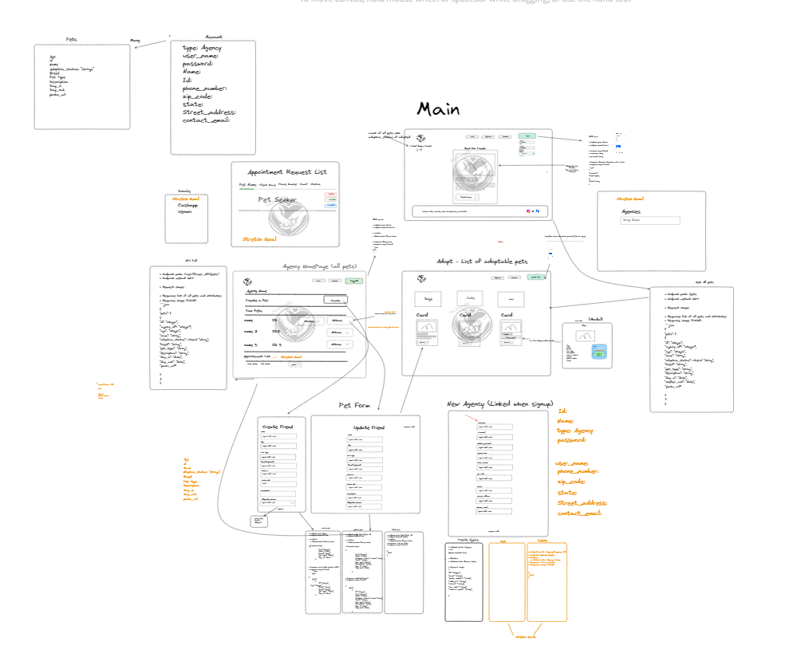

## Pet Friendly

Team:
Martin Maldonado
Joseph Lang
Dylin Frischman
Charles Agar

## What is this app?

The app is a way for pet adoption agencies to post their available pets for soon to be pet parents to look at. Once a pet is adopted the pet disappears from the list of pets and one more pet is added to the count of adopted pets on the main page. Adoption agencies sign up for an account which keeps track of all their pets. The agencies list their contact info for pet parents to contact them if they are intrested in a specific pet. Once a pet is adopted the agency can update the pet status as well as anything else they want.

## How do I access the App?

The simpliest way is to view the deployed webage:

https://pet_friendly.gitlab.io/pet-friendly/

If you wish to access the page for development purposes or review:

1. Install Docker Desktop: https://www.docker.com/products/docker-desktop/
2. Install Node.JS: https://nodejs.org/en
3. Fork and Clone the repository located here: https://gitlab.com/pet_friendly/pet-friendly
4. Run the following commands from the created directory:
   Docker compose build (this can take a while)
   Docker compose up
5. When done with development/review stop the docker containers and run the following command:
   Docker compose down

## Design



### API Documentation

#### Users

| Action                                  | Method | URL                                                         |
| --------------------------------------- | ------ | ----------------------------------------------------------- |
| [Get all users](#get-all-users)         | GET    | https://nov-2023-2-api.mod3projects.com/api/users           |
| [Create user](#create-a-user)           | POST   | https://nov-2023-2-api.mod3projects.com/api/users           |
| [Get all usernames](#get-all-usernames) | GET    | https://nov-2023-2-api.mod3projects.com/api/usernames       |
| [Get user pets](#get-user-pets)         | GET    | https://nov-2023-2-api.mod3projects.com/{user_id}/pets      |
| [Get user](#get-user)                   | GET    | https://nov-2023-2-api.mod3projects.com/api/users/{user_id} |
| [Update user](#update-a-user)           | PUT    | https://nov-2023-2-api.mod3projects.com/api/users/{user_id} |
| [Delete user](#delete-a-user)           | DELETE | https://nov-2023-2-api.mod3projects.com/api/users/{user_id} |

#### Get all users

##### Response:

```
[
  {
    "id": 0,
    "name": "string",
    "phone_number": "string",
    "email": "string",
    "address": "string",
    "state": "string",
    "zip_code": "string"
  }
]
```

#### Create a user

##### Request body:

```
{
  "name": "string",
  "phone_number": "string",
  "email": "string",
  "username": "string",
  "password": "string",
  "address": "string",
  "state": "string",
  "zip_code": "string"
}
```

##### Response:

```
{
  "access_token": "string",
  "token_type": "Bearer",
  "account": {
    "id": 0,
    "name": "string",
    "phone_number": "string",
    "email": "string",
    "username": "string",
    "address": "string",
    "state": "string",
    "zip_code": "string"
  }
}
```

#### Get all usernames

##### Response:

```
[
  {
    "username": "string"
  }
]
```

#### Get user pets

##### Response:

```
[
  {
    "id": 0,
    "name": "string",
    "age": "string",
    "breed": "string",
    "pet_type": "string",
    "description": "string",
    "adoption_status": "string",
    "day_in": "2024-03-20",
    "day_out": "2024-03-20",
    "owner_id": 0,
    "photo_url": "string"
  }
]
```

#### Get user

##### Response:

```
{
  "id": 0,
  "name": "string",
  "phone_number": "string",
  "email": "string",
  "address": "string",
  "state": "string",
  "zip_code": "string"
}

```

#### Update a user

##### Request body:

```
{
  "name": "string",
  "phone_number": "string",
  "email": "string",
  "address": "string",
  "state": "string",
  "zip_code": "string"
}
```

##### Response:

```
{
  "id": 0,
  "name": "string",
  "phone_number": "string",
  "email": "string",
  "address": "string",
  "state": "string",
  "zip_code": "string"
}
```

#### Delete a user

##### Response:

```
true
```

---

#### Pets

| Action                        | Method | URL                                                   |
| ----------------------------- | ------ | ----------------------------------------------------- |
| [Get all pets](#get-all-pets) | GET    | https://nov-2023-2-api.mod3projects.com/api/pets      |
| [Create a pet](#create-a-pet) | POST   | https://nov-2023-2-api.mod3projects.com/api/pets      |
| [Update a pet](#update-a-pet) | PUT    | https://nov-2023-2-api.mod3projects.com/pets/{pet_id} |

#### Get all pets

##### Response:

```
[
  {
    "id": 1,
    "name": "string",
    "age": "string",
    "breed": "string",
    "pet_type": "string",
    "description": null,
    "adoption_status": null,
    "day_in": "2024-03-21",
    "day_out": "None",
    "owner_id": 0,
    "photo_url": null
  }
]
```

#### Create a pet

##### Request body:

```
{
  "name": "string",
  "age": "string",
  "breed": "string",
  "pet_type": "string",
  "description": "string",
  "adoption_status": "string",
  "day_in": "string",
  "day_out": "string",
  "owner_id": 0,
  "photo_url": "string"
}

```

##### Response:

```
{
  "id": 1,
  "name": "string",
  "age": "string",
  "breed": "string",
  "pet_type": "string",
  "description": "string",
  "adoption_status": "string",
  "day_in": "string",
  "day_out": "string",
  "owner_id": 0,
  "photo_url": "string"
}
```

#### Update a pet

##### Request:

```
{
  "name": "string",
  "age": "string",
  "breed": "string",
  "pet_type": "string",
  "description": "string",
  "adoption_status": "string",
  "day_in": "string",
  "day_out": "string",
  "owner_id": 0,
  "photo_url": "string"
}
```

##### Response:

```
{
  "id": 0,
  "name": "string",
  "age": "string",
  "breed": "string",
  "pet_type": "string",
  "description": "string",
  "adoption_status": "string",
  "day_in": "string",
  "day_out": "string",
  "owner_id": 0,
  "photo_url": "string"
}
```
